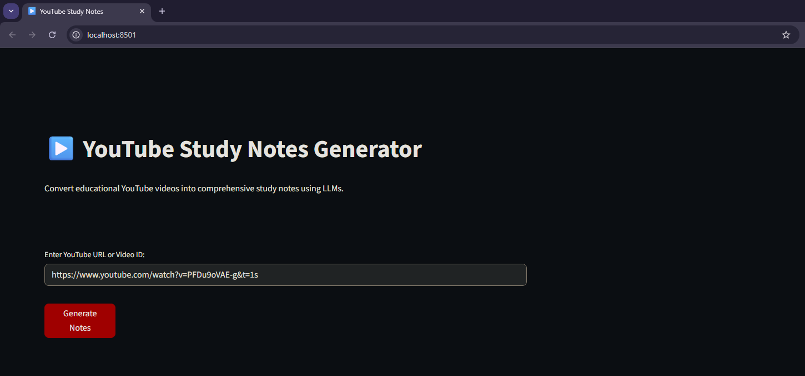
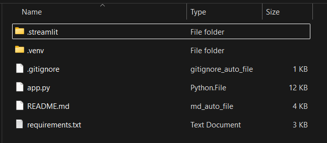

# 📘 YouTube Study Notes Generator

Transform educational YouTube videos into comprehensive, well-structured study notes powered by AI.

## Why I Built This ??

I wanted a quick way to convert any educational YouTube video I watch into clean, organized study notes that I can actually sit down and handwrite. Instead of scrambling to pause videos and manually note everything, this tool:

- **Automatically extracts** the entire transcript
- **Generates organized notes** in bite-sized sections
- **Formats everything clearly** so I can write it down without confusion
- **Breaks down complex concepts** into digestible explanations
- **Includes examples and definitions** all in one place

Now I can watch a video, generate notes in seconds, and spend my study time actually learning instead of transcribing.

<p align="center">
  
</p>

- Check out the [Sample Notes](https://github.com/ShishirBhat-Labs/Portfolio/blob/main/AI-Powered%20YouTube%20Study%20Notes%20Generator/Sample_notes.txt) generated for this [Video](https://www.youtube.com/watch?v=PFDu9oVAE-g&list=PLZHQObOWTQDPD3MizzM2xVFitgF8hE_ab&index=18) from 3Blue1Brown on EigenVectors and EigenValues

---

## Quick Start

### Prerequisites
- Python 3.8+
- Groq API key ([Get one here](https://console.groq.com))

### Installation

1. **Clone the repository**
   ```bash
   git clone https://github.com/yourusername/youtube-study-notes.git
   cd youtube-study-notes
   ```

2. **Create Virtual Environment**
   ```bash
   python -m venv .venv
   ```

3. **Install dependencies**
   ```bash
   pip install -r requirements.txt
   ```

4. **Configure API key**
   
   Create `.streamlit/secrets.toml`:
   ```toml
   GROQ_API_KEY = "your_api_key_here"
   ```

5. **File Structure**
   
   Your File structure should look something like this:
   <p align="center">
   
   </p>
   
7. **Run the app**
   ```bash
   streamlit run app.py
   ```

8. **Use the app**
   - Open http://localhost:8501 in your browser
   - Paste a YouTube URL or video ID
   - Click "Generate"
   - Download notes in Markdown or Text format

---

## Features

**AI-Powered Note Generation**
- Automatically generates comprehensive study notes from video transcripts
- Structured 6-part format (Overview, Definitions, Concepts, Examples, Procedures, Study Notes)

**Multiple Export Formats**
- Download as Markdown (.md)
- Download as Plain Text (.txt)

**Formula Rendering**
- Automatic conversion of plain text formulas to LaTeX
- Professional mathematical expression display

**Fast & Efficient**
- Uses Groq's fast LLM API
- Handles videos up to several hours long

**Structured Output**
- Consistent, academic formatting
- Easy to follow and comprehensive coverage


---
## Tech Stack

| Component | Role | Function |
|-----------|------|----------|
| **Streamlit** | Frontend | Renders UI, buttons, spinners, download options |
| **YouTube API** | Data Source | Extracts video transcripts |
| **Groq API** | AI Engine | Generates structured notes from transcripts |
| **Regex** | Text Processing | Extracts video IDs from URLs |
| **LaTeX** | Rendering | Makes formulas look professional |
| **Markdown** | Formatting | Structures notes (headers, bullets, tables) |
| **Python** | Language | Orchestrates everything |

---

## How It Works

1. **Extract** → Fetches transcript from YouTube video
2. **Process** → Sends transcript to AI with detailed formatting instructions
3. **Generate** → AI creates comprehensive study notes
4. **Beautify** → Converts formulas to LaTeX for professional display
5. **Export** → Download in your preferred format

```
┌─────────────────────────────────────────────────────┐
│ 1. USER ENTERS URL                                  │
└──────────────────┬──────────────────────────────────┘
                   │
┌──────────────────▼──────────────────────────────────┐
│ 2. EXTRACT VIDEO ID (regex)                         │
│    youtube.com/watch?v=XXX → XXX                    │
└──────────────────┬──────────────────────────────────┘
                   │
┌──────────────────▼──────────────────────────────────┐
│ 3. FETCH TRANSCRIPT (YouTube API)                   │
│    Video ID → Transcript (50k characters)           │
└──────────────────┬──────────────────────────────────┘
                   │
┌──────────────────▼──────────────────────────────────┐
│ 4. SEND TO AI (Groq API)                            │
│    Transcript + Instructions → LLM                  │
└──────────────────┬──────────────────────────────────┘
                   │
┌──────────────────▼──────────────────────────────────┐
│ 5. GENERATE NOTES (gpt-oss-20b)                     │
│    LLM generates structured notes (8k tokens)       │
└──────────────────┬──────────────────────────────────┘
                   │
┌──────────────────▼──────────────────────────────────┐
│ 6. PARSE RESPONSE (JSON)                            │
│    API response → Extract note content              │
└──────────────────┬──────────────────────────────────┘
                   │
┌──────────────────▼──────────────────────────────────┐
│ 7. BEAUTIFY FORMULAS                                │
│    "lambda" → "\lambda" (LaTeX conversion)          │
└──────────────────┬──────────────────────────────────┘
                   │
┌──────────────────▼──────────────────────────────────┐
│ 8. RENDER IN STREAMLIT                              │
│    - Headers (st.markdown)                          │
│    - Formulas (st.latex)                            │
│    - Tables & text (st.markdown)                    │
└──────────────────┬──────────────────────────────────┘
                   │
┌──────────────────▼──────────────────────────────────┐
│ 9. DISPLAY DOWNLOAD BUTTONS                         │
│    Markdown (.md) | Plain Text (.txt)               │
└─────────────────────────────────────────────────────┘

```

---

## Example Output

The app generates notes with:
- **Foundational Overview** - Core concepts and learning objectives
- **Key Terms & Definitions** - Comprehensive terminology table
- **Core Concepts** - Detailed explanations with examples
- **Worked Examples** - Step-by-step solutions
- **Procedures** - Algorithms and methods
- **Study Notes** - Critical points and common misconceptions

---

## Limitations

- Requires videos with available captions/transcripts
- Note quality depends on video content and clarity
- Requires active internet connection
- API rate limits apply (based on Groq plan)

---
