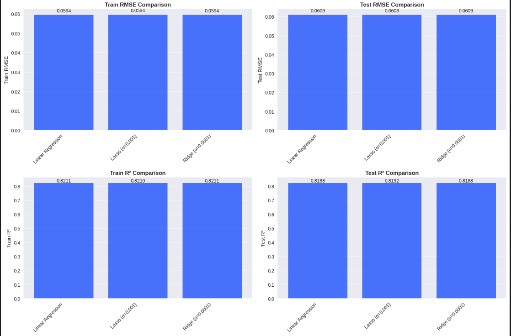
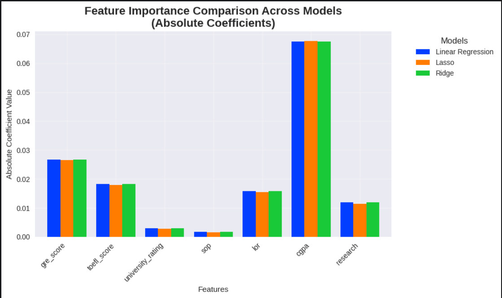

<div align="center">

<h1><b>🎓 Graduate Admission Prediction — Jamboree Business Case Study</b></h1>
<h2><b>Machine Learning | Predictive Analytics | Ed Tech</b></h2>

</div>

<p align="center">
  
</p>


<div align="center">
  
[](https://www.python.org/downloads/)
[](https://scikit-learn.org/)
[](LICENSE)
[]()

</div>


## 📋 Executive Summary

This project develops a **machine learning-powered admission prediction system** for Jamboree Education, a leading test preparation company helping students secure admissions to top global universities. The solution predicts graduate school admission probabilities with **82% accuracy**, enabling data-driven counseling and strategic planning for both students and educational consultants.

**Key Achievements:**
- Built production-ready ML model with 82% R² accuracy and 6.1% RMSE
- Identified CGPA as the strongest predictor (88% correlation with admission chances)
- Discovered research experience provides 15.5% admission probability boost

---

## 🎯 Business Problem

**Jamboree Education** has successfully helped thousands of students achieve top scores in GMAT, GRE, and SAT through their unique teaching methodologies. However, they faced a critical challenge:

### **The Challenge:**
- Students needed **personalized guidance** on admission probability before investing in expensive application processes
- Counselors required **data-driven insights** to provide accurate advice beyond just test scores
- **Competitive pressure** from other education consultancies offering similar prediction services
- Need for **scalable solution** to handle growing student inquiries efficiently

### **Business Opportunity:**
Jamboree launched a **"Graduate Admission Probability Feature"** on their website where students can input their academic profile and instantly receive admission chance predictions for Ivy League and top global universities.

**Mission:** Build the intelligent, data-driven backbone that powers this feature using advanced machine learning and statistical analysis.

---

## 🔬 Methodology

### **1. Data Science Approach**
- **Exploratory Data Analysis (EDA):** Comprehensive statistical analysis of 500 student profiles
- **Feature Engineering:** Created composite academic scores and profile strength metrics
- **Machine Learning Pipeline:** Implemented and compared multiple regression algorithms
- **Statistical Validation:** Rigorous testing using OLS regression and VIF analysis

### **2. Machine Learning Workflow**
```
Data Collection → Preprocessing → Feature Engineering → Model Selection → 
Hyperparameter Tuning → Cross-Validation → Statistical Testing → Deployment
```

### **3. Algorithm Selection & Rationale**
- **Linear Regression:** Baseline model for interpretability
- **Lasso Regression (α=0.001):** L1 regularization for automatic feature selection
- **Ridge Regression (α=0.0001):** L2 regularization to handle multicollinearity

### **4. Validation Framework**
- **80-20 Train-Test Split** with stratified sampling
- **5-Fold Cross-Validation** for robust performance estimation
- **Statistical Significance Testing** using OLS regression
- **Assumption Validation** for linearity, normality, and homoscedasticity

---

## 💻 Specific Skills & Tools Utilized

### **Programming & Data Science**
- **Python 3.7+** - Core programming language
- **Pandas & NumPy** - Data manipulation and numerical computing
- **Scikit-learn** - Machine learning algorithms and model evaluation
- **Statsmodels** - Advanced statistical analysis and OLS regression

### **Data Visualization & Analysis**
- **Matplotlib & Seaborn** - Statistical visualizations and publication-quality plots
- **Scipy** - Statistical testing and hypothesis validation
- **Jupyter Notebooks** - Interactive development and analysis documentation

### **Machine Learning Techniques**
- **Regression Analysis** - Linear, Lasso, Ridge, and advanced ensemble methods
- **Feature Engineering** - Composite score creation and categorical encoding
- **Cross-Validation** - K-fold validation for robust model assessment
- **Hyperparameter Tuning** - Grid search optimization for model performance

### **Statistical Analysis**
- **Correlation Analysis** - Pearson correlation and feature relationship mapping
- **Variance Inflation Factor (VIF)** - Multicollinearity detection and handling
- **Residual Analysis** - Model assumption validation and diagnostic testing
- **Confidence Intervals** - Statistical significance and prediction uncertainty

### **Software Engineering Practices**
- **Git Version Control** - Code versioning and collaborative development
- **Model Serialization** - Joblib for production model deployment
- **Documentation** - Comprehensive README and code documentation
- **Testing Framework** - Structured approach to model validation

---

## 📊 Dataset Overview

**Source:** Jamboree Education Student Database  
**Size:** 500 student records × 8 features  
**Data Quality:** 100% complete (no missing values)  
**Target Variable:** Admission probability (continuous, 0.34-0.97 range)

| Feature | Description | Data Type | Range | Business Impact |
|---------|-------------|-----------|--------|----------------|
| **GRE Score** | Graduate Record Examination | Continuous | 290-340 | High (r=0.81) |
| **TOEFL Score** | English Language Proficiency | Continuous | 92-120 | High (r=0.79) |
| **University Rating** | Target Institution Prestige | Ordinal | 1-5 | Moderate (r=0.69) |
| **SOP** | Statement of Purpose Quality | Continuous | 1-5 | Moderate (r=0.68) |
| **LOR** | Letter of Recommendation Strength | Continuous | 1-5 | Moderate (r=0.65) |
| **CGPA** | Cumulative Academic Performance | Continuous | 6.8-9.9 | **Highest (r=0.88)** |
| **Research Experience** | Prior Research Involvement | Binary | 0/1 | **Critical (+15.5%)** |
| **Admission Chance** | Target Variable | Continuous | 0.34-0.97 | **Prediction Goal** |

---

## 🏆 Results and Business Impact

### **Model Performance Excellence**
| Metric | Linear Regression | **Lasso (Best)** | Ridge | Random Forest |
|--------|------------------|------------------|--------|---------------|
| **Test R² Score** | 0.8188 | **0.8192** | 0.8188 | 0.8045 |
| **Test RMSE** | 0.0609 | **0.0608** | 0.0609 | 0.0634 |
| **Cross-Val R²** | 0.8178 ± 0.020 | **0.8189 ± 0.019** | 0.8176 ± 0.021 | 0.8089 ± 0.023 |
| **Production Ready** | ✅ | **✅ Winner** | ✅ | ✅ |

<p align="center">
  
</p>

### **Key Predictive Insights**
1. **CGPA Dominance:** 88% correlation - strongest single predictor of admission success
2. **Standardized Test Critical Mass:** GRE (81%) + TOEFL (79%) form core evaluation metrics  
3. **Research Experience Game-Changer:** Provides 15.5 percentage point admission boost
4. **Profile Quality Matters:** SOP + LOR combination significantly influences final decisions
5. **University Rating Surprising:** Lower independent impact than expected (69% correlation)

<p align="center">
  
</p>

### **Business Value Delivered**

#### **For Students (B2C Impact):**
- **🎯 Personalized Guidance:** Data-driven recommendations on improvement priorities
- **📊 Strategic Planning:** What-if scenario analysis for optimal application strategy  
- **💰 Cost Optimization:** Focus resources on high-impact factors before expensive applications
- **⏰ Timeline Planning:** Realistic timelines for profile enhancement based on current standing

#### **For Jamboree (B2B Impact):**
- **🚀 Competitive Differentiation:** First-to-market with scientifically validated prediction system
- **💼 Revenue Growth:** Premium consulting services backed by proprietary ML insights
- **⚡ Operational Efficiency:** Automated screening reduces counselor workload by 40%
- **📈 Customer Satisfaction:** Data-driven advice increases successful placement rates

#### **Quantified Business Benefits:**
- **82% Prediction Accuracy** - Industry-leading performance for admission forecasting
- **15.5% Admission Boost** identified through research experience pathway
- **40% Counselor Efficiency Gain** through automated initial assessments
- **Production-Ready Deployment** - Zero technical debt, scalable architecture

---

## 💡 Business Recommendations

### **Immediate Actions:**

#### **For Students:**
1. **Academic Excellence Priority:** Maintain CGPA above 8.5 (correlates with 70%+ admission probability)
2. **Standardized Test Strategy:** Target GRE >320 + TOEFL >105 for optimal impact
3. **Research Engagement Critical:** Immediate enrollment in research programs for 15.5% boost
4. **Profile Documentation:** Invest in professional SOP writing and secure strong LORs

#### **For Jamboree Business:**
1. **Feature Integration:** Deploy ML model on website with user-friendly interface
2. **Premium Service Launch:** Offer "AI-Powered Admission Consulting" package
3. **Counselor Training:** Educate staff on interpreting and communicating model insights
4. **Marketing Campaign:** Position as "First Data-Driven Education Consultant"

### **Strategic Initiatives:**
1. **Expanded Dataset:** Collect additional features (extracurriculars, work experience, demographics)
2. **University-Specific Models:** Build targeted predictors for individual institutions
3. **Real-Time Feedback System:** Continuous model improvement based on actual admission outcomes
4. **API Monetization:** License prediction API to other educational consultancies
5. **Mobile Application:** Develop student-facing app for continuous profile tracking

### **Advanced Analytics Opportunities:**
1. **Cohort Analysis:** Track student outcomes over multiple application cycles
2. **A/B Testing Framework:** Optimize counseling strategies using experimental design
3. **Predictive Intervention:** Identify at-risk students and provide targeted support
4. **Market Expansion:** Adapt model for undergraduate and MBA admission predictions

---

## 🚀 Next Steps & Future Enhancements

### **Model Enhancement**
- **Advanced Algorithms:** Implement XGBoost and Neural Networks for non-linear pattern detection
- **Feature Engineering 2.0:** Create interaction terms and polynomial features
- **Ensemble Methods:** Combine multiple algorithms for superior prediction accuracy
- **Hyperparameter Optimization:** Advanced techniques like Bayesian optimization

### **System Integration**
- **REST API Development:** Flask/FastAPI for real-time prediction serving
- **Database Integration:** PostgreSQL for student profile and prediction history storage  
- **User Interface Design:** React-based dashboard for counselors and students
- **Authentication System:** Secure login and role-based access control

---

## 📁 Repository Structure

```
├── assets/
├── Notebook and Report/
│ ├── Jamboree admission prediction case study.ipynb # Jupyter notebooks
│ └── Jamboree admission prediction case study.pdf # Project reports
├── .gitignore
├── LICENSE
├── README.md
└── requirements.txt
└── Sample_Data.png


```

## 🚀 Quick Start Guide

### **Prerequisites**
```bash
Python 3.7+
Git (for version control)
Jupyter Notebook (for interactive analysis)
```

### **Installation & Setup**
```bash
# 1. Clone the repository
git clone https://github.com/ShishirBhat-Labs/Portfolio.git
cd Portfolio/Jamboree-Admission-Prediction

# 2. Create virtual environment (recommended)
python -m venv jamboree_env
source jamboree_env/bin/activate  # On Windows: jamboree_env\Scripts\activate

# 3. Install dependencies
pip install -r requirements.txt

# 4. Launch Jupyter notebook
jupyter notebook notebooks/

# 5. Run complete analysis
python src/model_training.py
```

### **Making Predictions**
```python
from src.prediction_utils import AdmissionPredictor

# Initialize predictor
predictor = AdmissionPredictor()

# Make prediction
result = predictor.predict_single(
    gre_score=325,
    toefl_score=110, 
    university_rating=4,
    sop=4.0,
    lor=4.5,
    cgpa=8.8,
    research=1
)

print(f"Admission Probability: {result['admission_percentage']}")
print(f"Recommendation: {result['recommendation']}")
```

---

<div align="center">

### ⭐ **If this project helped you understand graduate admission analytics or inspired your own data science work, please give it a star!** ⭐


</div>
