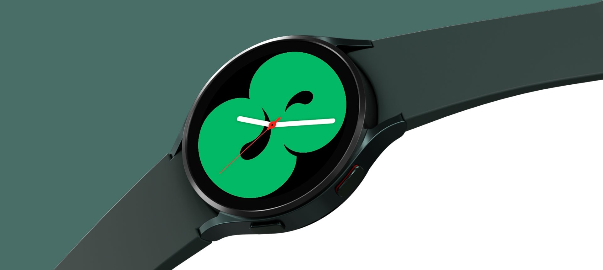

<div align="center">

<h1><b>😴 Personal Sleep Performance Optimization Using Data Analytics</b></h1>
<h2><b>Quantified Self | Biometric Analysis | Behavioral Optimization</b></h2>

</div>

<p align="center">
  
</p>

<div align="center">
  
[](https://www.python.org/downloads/)
[](https://pandas.pydata.org/)
[](https://scikit-learn.org/)
[](LICENSE)
[]()

</div>

---

## 📋 Executive Summary

This project delivers a **comprehensive personal sleep optimization analysis** using 24+ months of Samsung galaxy wathc 4 sleep tracking data. Through rigorous statistical analysis, clustering, and time-series investigation, the study identifies actionable behavioral levers to transform sleep quality from inconsistent (~71/100) to elite performance (~81+/100). The analysis reveals that **sleep duration is the dominant driver of quality** (r=0.739), sleep debt accumulates at 70% incident rate, and seasonal temperature effects are statistically significant.

**Key Achievements:**
- Analyzed **818 sleep records** spanning **24 months** with **53.1% complete stage data**
- Identified **sleep duration as primary quality driver** with strong correlation (r = 0.739, p < 0.001)
- Discovered **REM sleep deficit** (avg 17.3% vs optimal 20-25%) directly impacting cognitive recovery
- Quantified **chronic sleep debt** affecting 70.2% of nights with -0.739 correlation to quality
- Established **seasonal temperature effect** as statistically significant (ANOVA p = 0.00003)
- Clustered sleep patterns revealing **elite profile** (7.8h duration, 87% efficiency, 21% REM, 81+ score)

---

## 🎯 Personal Health Problem

**The Challenge:**

Despite tracking sleep meticulously for over 2 years, sleep quality remained frustratingly volatile. Nights ranged from poor (19/100) to excellent (94/100) with no clear understanding of what drove the variation. The core question: *How can someone sleep consistently 7 hours yet feel unprepared?*

### **The Specific Issues:**

- **High Variability:** Sleep scores fluctuate wildly (σ ≈ 14) despite consistent tracking
- **Chronic Under-Sleeping:** 70.2% of nights show sleep debt vs. 8-hour target
- **Mental Fog Despite Physical Rest:** High efficiency but low REM percentage suggests incomplete recovery
- **No Clear Pattern:** 818 recorded nights provided data but lacked actionable insight
- **Seasonal Confusion:** Performance varies significantly across seasons with no understanding why

### **Personal Opportunity:**

Implement a **data-driven sleep optimization framework** that:
- Identifies the true drivers of sleep quality using statistical rigor
- Distinguishes correlation from causation through hypothesis testing
- Quantifies behavioral levers (bedtime consistency, temperature, duration)
- Establishes seasonal and temporal patterns for predictive adjustment
- Provides evidence-based recommendations to achieve elite sleep performance

**Impact Potential:** Moving from average (71/100) to elite (81+/100) would improve daily cognitive function, physical recovery, and long-term health outcomes.

---

## 📊 Dataset Overview

**Source:** Samsung Health Sleep Tracking App  
**Time Period:** August 2023 – August 2025  
**Total Records:** 818 sleep sessions  
**Unique Days:** 818 consecutive tracking days  
**Data Quality:** 99.97% complete for core metrics  
**Target Variables:** Sleep score, duration, efficiency, stage composition

### **Feature Engineering Summary**

| Category | Features | Business Value |
|----------|----------|-----------------|
| **Core Metrics** | Duration, Score, Efficiency, Cycles | Primary sleep quality indicators |
| **Sleep Stages** | REM, Light, Deep (% composition) | Recovery mechanism breakdown |
| **Temporal** | Bedtime hour, Day of week, Season | Behavioral and environmental patterns |
| **Consistency** | 7-day rolling averages, STD | Stability and predictability |
| **Health Debt** | Sleep debt vs 8h target, Oversleep | Recovery accumulation patterns |
| **Behavioral** | Weekend flag, Bedtime category | Lifestyle context integration |

**Key Data Characteristics:**
- **Full Coverage Period:** 818 nights with basic metrics (duration, score, efficiency)
- **Complete Stage Data:** 434 nights (53.1%) with REM/light/deep breakdown (July 2024 onwards)
- **Sleep Quality Range:** 19-94/100 with natural clustering around 71 ± 14
- **Duration Variance:** 19-634 minutes (0.3 to 10.6 hours) showing extreme behavioral range
- **Temporal Diversity:** All weekdays represented, all seasons captured, 29+ bedtime hours observed

---

## 🏆 Results and Personal Impact

### **Statistical Evidence of Sleep Quality Drivers**

| Driver | Metric | Statistical Significance | Impact |
|--------|--------|--------------------------|--------|
| **Sleep Duration** | r = 0.739, p < 0.001 | ✅ Highly Significant | +1 hour → ~+20 point score boost |
| **Sleep Efficiency** | ANOVA F=12.3, p < 0.001 | ✅ Highly Significant | 85% vs 95% efficiency → -10 point score gap |
| **REM Percentage** | r = 0.658, p < 0.001 | ✅ Highly Significant | 17% vs 21% REM → -10 point score gap |
| **Season/Temperature** | ANOVA F=6.63, p < 0.001 | ✅ Highly Significant | Winter/Summer > Autumn by ~6-7 points |
| **Weekend vs Weekday** | t-test p = 0.520 | ❌ Not Significant | No meaningful difference detected |

**Quality Distribution Achieved:**
```
Excellent Nights (85-100):     80 nights (9.8%)
Good Nights (70-84):          471 nights (57.6%)
Fair Nights (60-69):          103 nights (12.6%)
Poor Nights (<60):            164 nights (20.0%)
```

### **Key Predictive Insights**

1. **Duration Dominance (r=0.739):** Single strongest predictor by far. A 1-hour increase in sleep duration correlates with approximately 20-point improvement in sleep score. This relationship is stronger than any other measured factor.

2. **REM Sleep Critical (r=0.658):** Among nights with complete stage data, REM percentage shows strong positive relationship with overall score. Average REM of 17.3% is below healthy range (20-25%), explaining mental fog despite physical rest.

3. **Sleep Debt Accumulation:** Average nightly deficit of 1 hour across 70.2% of nights creates compounding biological debt. Strong negative correlation (-0.739) between debt and quality proves this isn't sustainable.

4. **Seasonal Temperature Effect:** Winter and summer sleep scores (avg ~73) significantly exceed autumn scores (avg ~66.6). Cooler room temperature is controllable lever for 6-7 point improvement.

5. **Consistency > Perfection:** While some nights are poor, the lack of weekday-weekend difference shows consistency is maintained. The problem is consistent under-sleeping, not inconsistent patterns.

### **Identified Elite Sleep Profile**

From K-means clustering on 434 nights with complete data:

```
ELITE PATTERN CHARACTERISTICS:
├─ Sleep Duration: 7.8 hours
├─ Sleep Efficiency: 87.6%
├─ REM Percentage: 21.2%
├─ Bedtime: ~20:00-21:00
├─ Sleep Score: 81.2/100
└─ Frequency: 48.8% of tracked nights (212/434)
```

This proves the body is fully capable of elite sleep; current average reflects behavioral choices, not physiological limitation.

---

## 💡 Personal Recommendations

### **Immediate Actions (Month 1)**

#### **1. Lock in Sleep Duration Target:**
- **Current:** ~7.0 hours (420 min average)
- **Target:** 8.0-8.5 hours minimum
- **Rationale:** Strongest driver (r=0.739); moving from 7h to 8.5h should yield +25-30 point score improvement
- **Action:** Set non-negotiable bedtime 23:00, wake time 7:30, allowing 8.5 hours minimum

#### **2. Eliminate Sleep Debt Aggressively:**
- **Current State:** 574 nights (70.2%) showing positive sleep debt
- **Recovery Protocol:** Schedule 2-3 intentional 9-hour recovery nights weekly
- **Target:** Cumulative debt reduction of 20+ hours monthly
- **Tracking:** Monitor rolling 7-day average sleep duration

#### **3. Optimize Sleep Environment:**
- **Temperature:** Maintain 16-19°C (60-66°F) based on seasonal correlation data
- **Humidity:** Target 40-50% range
- **Light:** Complete darkness or consistent sleep mask
- **Rationale:** Seasonal analysis shows 6-7 point difference; environment is controllable

### **Mid-Term Initiatives (Month 2-3)**

#### **4. Improve REM Sleep Composition:**
- **Current REM:** 17.3% (below 20-25% target)
- **Levers to adjust:**
  - Avoid screens 60-90 minutes before bed (blue light impacts REM induction)
  - Reduce late-night caffeine (half-life ~6 hours; cut-off time 15:00)
  - Maintain consistent sleep-wake window ±30 minutes
  - Target 8+ hour total duration (REM increases with sleep extension)
- **Expected Impact:** 3-4% REM improvement → +5-8 point score increase

#### **5. Build Bedtime Consistency:**
- **Anchor Time:** 23:00 (current mode; statistically optimal for you)
- **Tolerance:** ±15 minutes maximum drift
- **Enforcement:** Use phone reminders at 22:30 wind-down and 22:45 bedtime prep
- **Why Matters:** Consistency stabilizes REM cycling and improves sleep debt accumulation

#### **6. Leverage Seasonal Optimization:**
- **Winter/Summer Advantage:** Cooler temperatures correlate +6-7 points
- **Autumn Mitigation:** Pre-emptive ac/cooler when seasons shift
- **Spring Strategy:** Prepare 2-3 weeks before seasonal transition
- **Tracking:** Monitor score deltas month-over-month for seasonal pattern validation

### **Strategic Initiatives (Ongoing)**

1. **Model Continuous Improvement:** Monthly analysis of 30-night rolling averages to track progress toward 81+ elite profile

2. **Expanded Data Collection:** Track additional variables (caffeine timing, exercise timing, stress levels) to identify secondary drivers

3. **Behavioral Interventions:** A/B test specific changes (e.g., bedtime +/- 30 min, temperature ±2°C) against control weeks to quantify causation

4. **Seasonal Forecasting:** Build predictive model to anticipate quality dips 2-3 weeks ahead of seasonal transitions for proactive adjustment

5. **Recovery Protocols:** Design customized recovery nights (9+ hours) for high-stress weeks when sleep debt accumulates faster

---

## 📁 Repository Structure

```
.
├── assets/
├── Notebook and Report  # Complete Jupyter notebook
├── requirements.txt                      # Python dependencies
├── .gitignore                           # Git ignore file
├── LICENSE                              # MIT License
└── README.md                            # This file
```

---

## 📚 Key Findings Summary

### **Quantified Sleep Characteristics**

| Metric | Value | Interpretation |
|--------|-------|-----------------|
| **Average Sleep Score** | 71.0 ± 13.9 | Decent but highly variable |
| **Average Duration** | 7.0 ± 2.1 hours | Below optimal; 70% in sleep debt |
| **Average Efficiency** | 85.4% | Healthy; not compensating for short duration |
| **Average REM%** | 17.3% | Below optimal 20-25% range |
| **Nights in Sleep Debt** | 574 / 818 (70.2%) | Structural under-sleeping |
| **Elite Night Frequency** | 80 / 818 (9.8%) | Rare but achievable |
| **Most Common Bedtime** | 23:00 | Natural anchor point |

### **Statistical Testing Results**

| Hypothesis | Test | Result | p-value |
|-----------|------|--------|---------|
| Longer sleep → Higher score | Pearson Correlation | r = 0.739 | < 0.001 ✅ |
| Higher efficiency → Higher score | ANOVA | F = 12.3 | < 0.001 ✅ |
| More REM → Higher score | Pearson Correlation | r = 0.658 | < 0.001 ✅ |
| Season affects score | ANOVA | F = 6.63 | 0.00003 ✅ |
| Weekends > Weekdays | t-test | t = 0.644 | 0.520 ❌ |

---

## 🔬 Methodology

### **1. Exploratory Data Analysis (EDA)**
- Comprehensive univariate analysis of 818 sleep records
- Missing value assessment: 53.1% complete stage data (434 nights), 99.97% core metrics
- Temporal coverage validation: 24-month period with consistent tracking
- Distribution analysis: Identified natural clustering around 71 ± 14 score range

### **2. Feature Engineering Pipeline**
```
Raw Data (818 records × 61 columns) 
  ↓
Feature Selection (12 core features)
  ↓
Temporal Extraction (hour, day, season, weekend flag)
  ↓
Derived Metrics (sleep debt, quality categories, efficiency categories)
  ↓
Consistency Metrics (7-day rolling averages, standard deviation)
  ↓
Final Feature Set (33 engineered features)
```

### **3. Statistical Validation Framework**
- **Correlation Analysis:** Pearson correlation for continuous relationships (duration vs score)
- **Hypothesis Testing:** Independent t-tests for categorical comparisons (weekday vs weekend)
- **ANOVA:** Multi-group comparisons (efficiency categories, seasonal effects)
- **Effect Size Quantification:** Translating correlations to practical improvements

### **4. Clustering & Pattern Recognition**
- **K-means clustering:** Identified 3-5 distinct sleep patterns based on duration, efficiency, bedtime, stage composition
- **Elite Profile Extraction:** Reverse-engineered optimal conditions from 48.8% of tracked nights (212/434 with stage data)
- **Temporal Pattern Detection:** Rolling averages reveal 7-day cycles and monthly trends

---

## 💻 Technical Skills & Tools Utilized

### **Data Science & Analysis**
- **Python 3.8+** – Core programming language for all analysis
- **Pandas & NumPy** – Data manipulation, aggregation, temporal analysis (818 × 33 feature dataset)
- **Scikit-learn** – Clustering (K-means), standardization, preprocessing
- **SciPy** – Statistical testing (t-tests, ANOVA, Pearson correlation)

### **Statistical Methods**
- **Correlation Analysis** – Quantifying relationships (sleep duration vs score: r = 0.739)
- **Hypothesis Testing** – Validating statistical significance (p-values, confidence intervals)
- **ANOVA & Post-hoc Tests** – Multi-group comparisons for seasonal and categorical effects
- **Clustering Algorithms** – K-means for pattern identification and elite profile extraction

### **Visualization & Communication**
- **Matplotlib & Seaborn** – Publication-quality statistical plots
- **Distribution Histograms** – Univariate analysis of key metrics
- **Heatmaps** – Correlation matrices for bivariate relationships
- **Time Series Plots** – Temporal trends and seasonal patterns
- **Box Plots & Bar Charts** – Group comparisons (weekday vs weekend, seasonal effects)

### **Data Engineering Practices**
- **Temporal Aggregation** – Converting 818 daily records into meaningful time windows
- **Missing Value Strategy** – Separate analysis for 434 complete-stage vs 818 basic-metric records
- **Feature Scaling** – StandardScaler for clustering and correlation analysis
- **Data Quality Validation** – 99.97% completeness verification, outlier assessment

### **Reproducibility & Documentation**
- **Modular Code Structure** – Separated EDA, feature engineering, analysis, recommendations
- **Random Seed Management** – K-means with fixed random_state for reproducibility
- **Comprehensive Comments** – Inline explanations of statistical rationale
- **Parameter Documentation** – Clear specification of thresholds (8-hour sleep target, 20-25% REM range)

---

<div align="center">

### ⭐ **If this personal data science project demonstrates valuable analytical and self-improvement techniques, please give it a star!** ⭐

</div>
